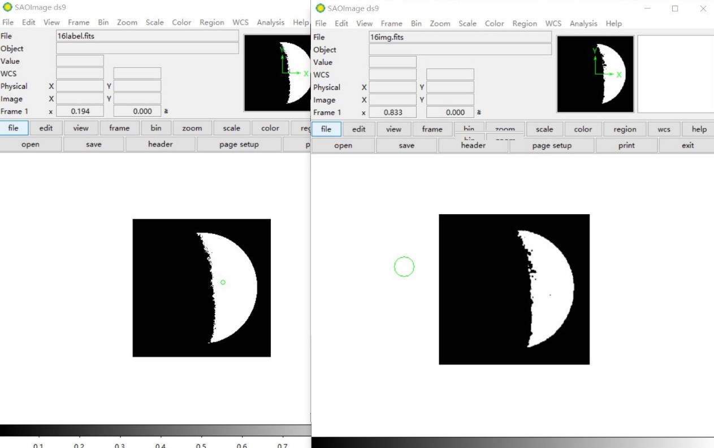

# Segnet
月球图像分割 
 
这个方法是国际上首次提出针对数字孪生应用的光电系统数据库，方法简单地利用数据库匹配实现了光学望远镜失调状态感知。 

<table width="100%" border="0" cellspacing="0" cellpadding="0">
  <tr>
    <td align="center"> </td>
  </tr>
  <tr>
    <td align="center">Fig.1 左为提供的标签二值化图像，右为网络测试结果图像。</td>
  </tr>

  

<table width="100%" border="0" cellspacing="0" cellpadding="0">
  <tr>
    <td align="center"></td>
  </tr>
  <tr>
    <td align="center">Fig.2 左为提供的标签二值化图像，右为网络测试结果图像。</td>
  </tr>

